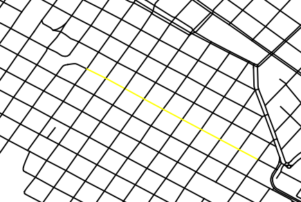
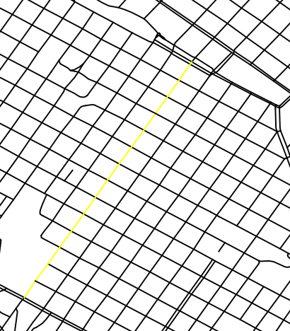
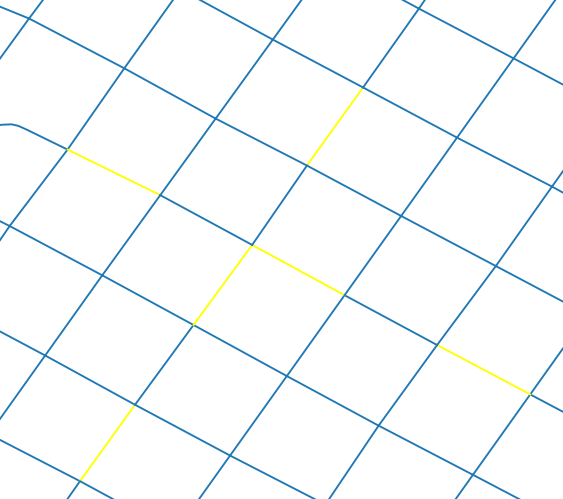
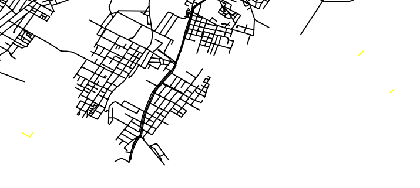

# Calcular tiempos de viaje entre puntos

Para hacer los análisis de accesibilidad, tal como se han planteado en el modelo potencial, se necesitan varios datos de entrada:

- Información poblacional,
- Información de las oportunidades (con localización),
- La red sobre la cual se hacen los viajes, y
- **el tiempo de viaje de puntos sobre la red.**

Este último punto es tal vez el más difícil.
Si se tiene una red de transporte (capa geográfica de líneas, seguramente en formato ESRI Shape) donde hay variables de velocidad, tiempo de viaje o distancia para cada línea (impedancia de la red), se debe considerar cada intersección como un nodo o punto desde y hacia donde se pueden hacer viajes. El objetivo es implementar un mecanismo computacional que permita calcular el tiempo de viaje (o longitud) desde un punto a cualquier otro punto. La implementación debe permitir ingresar viajes desde varios orígenes a varios destinos.

## Algorítmo (Concepto)

En R (as far as I know) no hay una forma para tomar un archivo shape de líneas (un *Multilines* en *sf*) y hacer ruteo. La librería [Dodger](https://atfutures.github.io/dodgr/) es una opción interesante pero mi impresión prelminar es que es muy orientado a datos de OSM.

Por eso, la idea fundamental es utilizar la librería **igraph** para transformar el objeto de *sf* a un grafo (clase *igraph*) y sobre este nuevo objeto hacer los calculos. [igraph](https://igraph.org/r/) es una librería para hacer diferentes operaciones sobre grafos, como encontrar la ruta entre nodos y obtener la impedancia.

[Tidygraph](https://tidygraph.data-imaginist.com/) es una versión de *igraph* que se artículo con el **tidyverse** y tiene una filosofía de funcionamiento similar. Recientemente, en [Este Blog](https://www.r-spatial.org/r/2019/09/26/spatial-networks.html) dieron una solución similar a la que estoy proponiendo pero usando el Tidygraph.

De momento, voy a implementar una solución usando solamente *igraph* porque en un proyecto previo en el que colaboro se está solucionando un problema parecido. En ese sentido, más que desarrollar es re-editar y ajustar el código. Sin embargo, seguramente la solución se termine migrando a *Tidygraph*. Igualmente, hay que revisar con calma *Dodgr*.

Lo que implemente va a estar en el archivo **CalculationPrototype.Rmd** de esta misma carpeta y, si se crean funciones, por ahora se van a mantener en ese archivo.

## Datos de prueba

En la carpeta **ToyData** hay algunas bases de datos para probar y hacer la implementación, pero son datos ya muy parecidos a los reales.

La Carpeta **uruguay-latest-free.shp** fue descargada de [Geogabrik](http://download.geofabrik.de/south-america/uruguay.html) y tiene la red de transporte.

El Archivo **RiveraNetwork_Toy.shp** es el que vamos a usar para prototipar. Fue construído cargando la red de *Geogabrik* (que son datos de **OSM**) y haciendo un corte manual en QGIS para el municipio de Rivera. Este archivo es consistente con el siguiente error: Las calles no se cortan en las intersecciones; es decir, hay una sobreposición pero las líneas no están unidas. A continuación se muestran dos ejemplos donde se seleccionó una línea. Como se puede ver, esta línea en realidad deberían ser varias líneas.

**¿Cómo solucionarlo?**

[GRASS](https://grass.osgeo.org/grass76/manuals/index.html) trae la función [v.clean](https://grass.osgeo.org/grass76/manuals/v.clean.html) para arreglar este tipo de problemas.
 Intenté las siguientes dos opciones sin éxito:

 - Traté de lanzar GRASS desde R usando **link2GI** y **rgrass7** pero no fue posible hacer la conexión. El problema puede ser que estoy usando un computador con windows (lo cual siempre crea problemas adicionales) o que al estar usando la última versión de QGIS y de GRASS, hay problemas de compatibilidad con las librerías.
- Traté de usar los algorítmos de geoprocesamiento de QGIS (3.10.0) entre los cuales está *v.clean* de GRASS, pero salió un error.

Dado que el proyecto no se enfoca en construir herramientas computacionales para mejor funcionalidades GIS, opté por una opción que funciona (arregla la red). Sin embargo no es usando una consola y la reproducibilidad debe ser manual.

En la instalación de QGIS se instala también **QGIS 3.10.0 with GRASS 7.6.1**. No tengo claro cuál esl a diferencia pero de momento, abriendo este programa puedo usar GRASS sin problema.

**El Resultado:**

El resultado se puede ver en la siguiente Figura:

Con la función *v.clean* de *GRASS* se obtiene una red donde las líneas se han cortado cada vez que se cruzan con otras. Esto requiere una **verificación manual** ya que puede suceder que en el shape algunas líneas se intersecten pero que en la realidad no exista una conexión, por ejemplo, si es un paso a desnivel, un puente o un túnel. Adicional a esto, al red tiene algunas inconsistencias menores que se deben revisar y corregir manualmente como se ilustra en la siguiente Figura:

## Implementación

La implementación preliminar está en el archivo **"CalculationPrototype.Rmd"** (dentro de la misma carpeta que este archivo) y genera dos resultados que están en la carpeta **ToyData**:

- **"Distances_Toy.csv"**: Este objeto tiene el valor de las distancias (que en realidad deberían ser tiempos de viaje) para cada par origen destino. 
- **"Nodes_Toy.csv"**: Son los nodos con las coordendas y la variable de identificación. Es importante tener muy presente que *el CRS de este objeto (cuando se convierta a un shape) debe ser establecido (NO PROYECTADO) al mismo CRS del archivo de líneas de OSM originalmente utilizado-*
